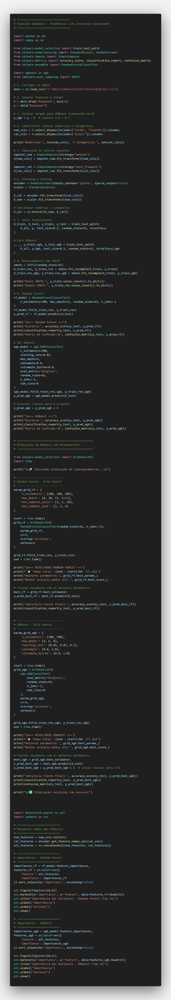
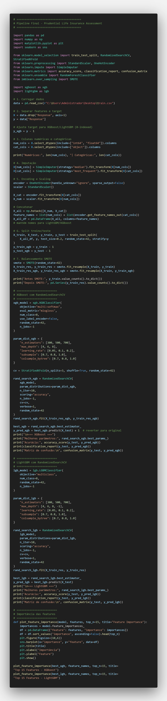
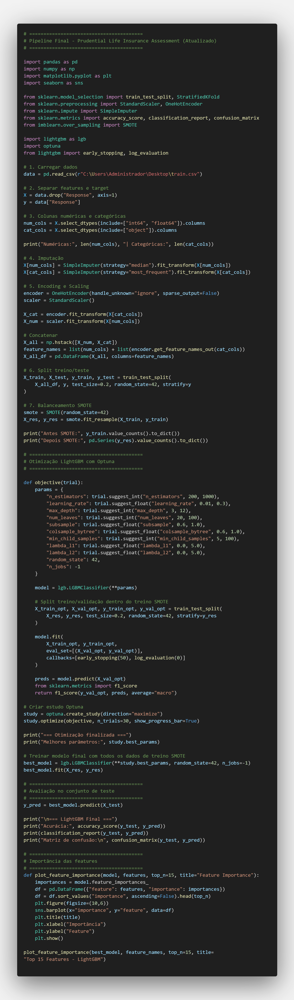
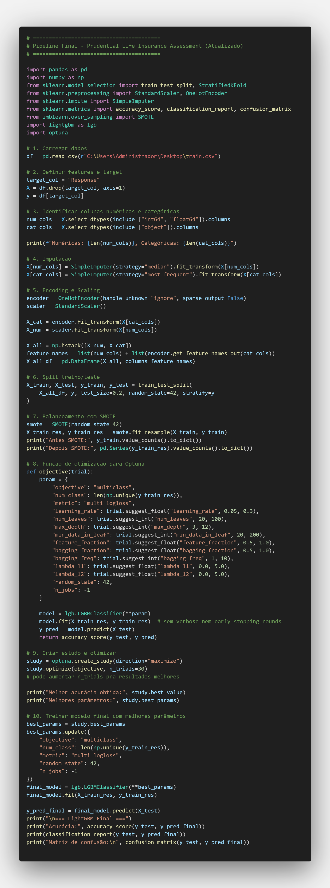
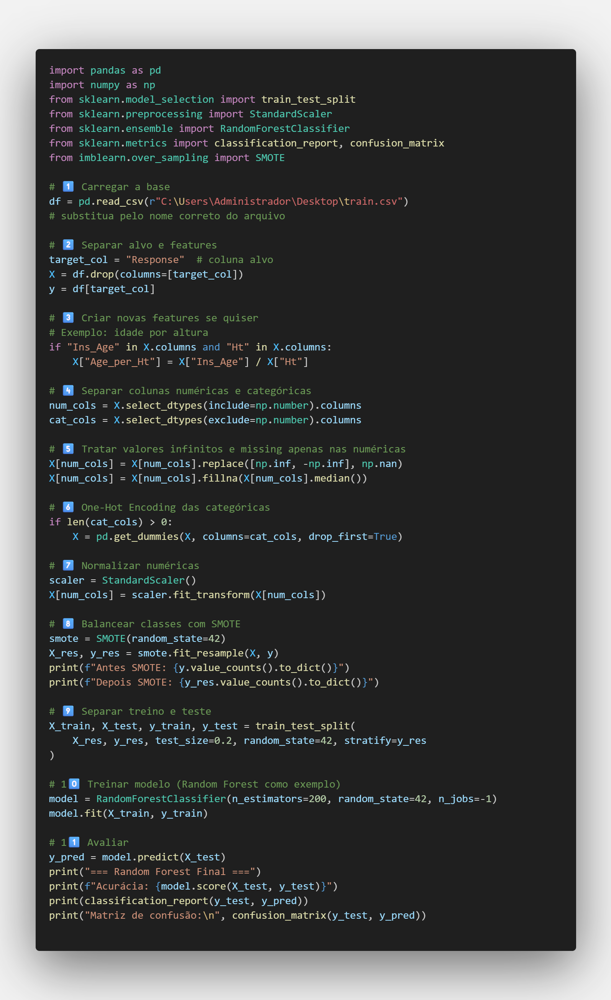

# Uso de Aprendizado de Máquina para Previsão de Riscos em Seguros de Vida

Este repositório contém as imagens dos códigos utilizados no Trabalho de Conclusão de Curso (TCC) **"Uso de Aprendizado de Máquina para Previsão de Riscos em Seguros de Vida: Uma Análise das Aplicações e Impactos no Mercado Securitário Brasileiro"**.  

O objetivo do projeto é aplicar técnicas de **Machine Learning** para previsão de risco em seguros de vida, avaliando diferentes modelos, estratégias de pré-processamento, otimização de hiperparâmetros e balanceamento de classes.

---

## 🗂 Estrutura do Repositório

/tcc-ml-seguros-vida
│
├── images/ # Imagens dos códigos utilizados nos testes
├── README.md # Documentação principal do projeto

yaml
Copiar código

> Obs.: Como o repositório contém apenas imagens para fins de visualização do código, não há arquivos de script `.py` neste repositório.

---

## 🖼 Códigos Utilizados nos Testes (Seção 4 do TCC)

As imagens abaixo correspondem aos códigos implementados em cada um dos cinco testes realizados.

### 📌 Teste 1 — Random Forest e XGBoost com GridSearchCV

### 📌 Teste 2 — Random Forest e XGBoost com RandomizedSearchCV

### 📌 Teste 3 — LGBM com Optuna (50 iterações)

### 📌 Teste 4 — LGBM com Optuna (ajuste final de hiperparâmetros)

### 📌 Teste 5 — Pipeline completo com Random Forest + SMOTE

---

## 📚 Finalidade Acadêmica

Este repositório serve para documentação e visualização dos códigos utilizados nos testes do TCC, garantindo **transparência e reprodutibilidade** das análises realizadas sobre previsão de risco em seguros de vida.

---

## ✉ Contato

**Autores:** Ryan Paulo, Gabriel Lima  
**Ano:** 2025  
**Curso:** Sistemas de Informação
